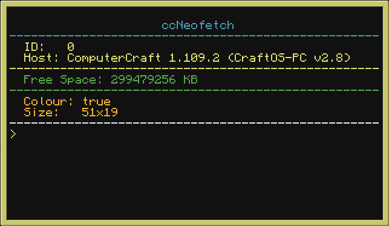

# CC GLib

A standard set of libraries/tools for CC Tweaked.

## Install

The following command will install the latest version of glib:

```bash
wget run https://raw.githubusercontent.com/ghostdevv/cc-glib/main/lib/glib.lua install
```

## Updating

You can simply run:

```bash
glib update
```

`update` and `install` are equivalent commands

## Commands

### `glib`

The primary glib command which allows you to interact/manage the library.

```bash
$ glib help
GLib v0.2.0

  Usage
    glib <command>

  Available Commands
    help               Show this help message
    version            Get the current version of GLib
    install, update    (re)install GLib
```

### `fuel`

> This command is only installed on turtles

The `fuel` command simply lists out the current fuel and fuel limit.

```bash
$ fuel
Fuel Level: 11157/100000
```

### `neofetch`

The `neofetch` command is inspired by the popular [bash based neofetch tool](https://github.com/dylanaraps/neofetch).

```bash
$ neofetch
```



### `mine`

> This command is only installed on turtles

The `mine` command ([`ghostdevv/mining-turtle`](https://github.com/ghostdevv/mining-turtle)) is used to mine an area the user defines.

```bash
$ mine <width> <height> <depth>
```
